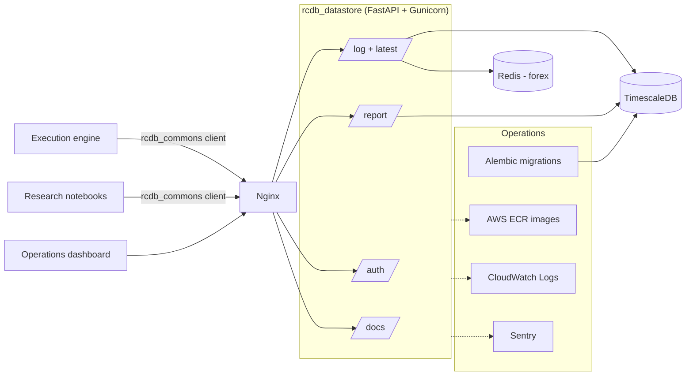
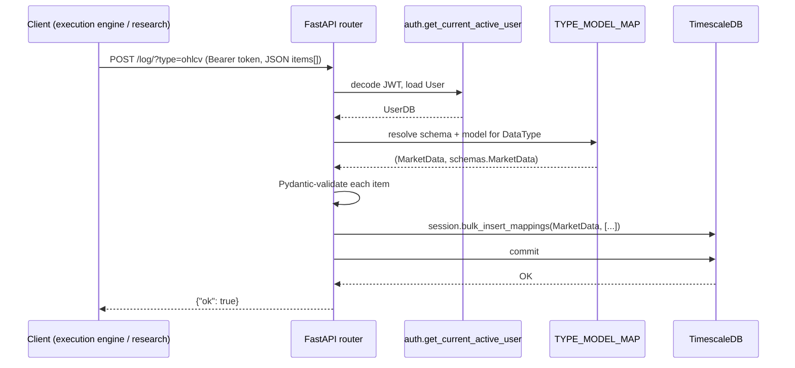

# rcdb_datastore

> FastAPI + TimescaleDB time-series API that powered the RCDB multi-exchange automated trading platform.

[](https://www.python.org/)
[](https://fastapi.tiangolo.com/)
[](https://www.timescale.com/)
[](https://www.sqlalchemy.org/)
[](https://alembic.sqlalchemy.org/)
[](https://aws.amazon.com/ecr/)
[](#lineage)

**Archived.** Cloned from `hcmc-project/rcdb_datastore` for posterity. Part of the **RCDB** automated trading platform, later merged into [3Jane Technologies](https://github.com/3jane). No longer maintained.

> Swagger docs are served at the root route: `http://localhost/` (HTTP Basic auth required).

---

## Table of contents

- [What this was](#what-this-was)
- [Tech stack](#tech-stack)
- [Data domain](#data-domain)
- [API surface](#api-surface)
- [Architecture](#architecture)
- [Operations](#operations)
- [Lineage](#lineage)
- [Sibling repos](#sibling-repos)

---

## What this was

`rcdb_datastore` was the central time-series store for the RCDB automated trading platform. It ingested and served heterogeneous market and trading data from multiple exchanges through a single, uniform HTTP API: OHLCV candles, Kalman-filtered signal streams, bot performance telemetry, price indices, bid/ask snapshots, orderbook ticks, aggregated trades, account balances, transfers, and exchange rebates.

Every domain has its own SQLAlchemy model with an indexed `timestamp` column and a small, opinionated set of filterable fields (exchange, symbol, account type, channel, bot id, transfer type). A single declarative map in `app/views/log.py` - `TYPE_MODEL_MAP` - binds each `DataType` to its model, Pydantic schema, and filter columns, so the `/log/` (write) and `/latest/` (read) endpoints work polymorphically across every data type without per-domain controller code.

The store is built on **TimescaleDB** (Postgres with native time-series hypertables) and uses raw SQL via SQLAlchemy `text()` for analytical reports - including a periodic-rebate reconciliation report that joins expected versus received maker rebates per account, currency, and timeframe using `time_bucket`. Auth supports both OAuth2 bearer tokens (with a query-param fallback) and HTTP Basic (for the Swagger UI). Deployment is Docker Compose with images hosted on AWS ECR, CloudWatch for log aggregation, and Sentry for error tracking.

## Tech stack

| Layer | Tools |
|---|---|
| API framework | FastAPI 0.63, Pydantic 1.8, Uvicorn + uvloop, Gunicorn (UvicornWorker) |
| Persistence | TimescaleDB 2.1 (Postgres 12), SQLAlchemy 1.3, Alembic 1.5, psycopg2 |
| Cache / pub-sub | Redis 6.2 (aioredis) - used for live forex prices |
| Auth | OAuth2 bearer (PyJWT), HTTP Basic, pbkdf2_sha256 (passlib) |
| Edge | Nginx (containerized) |
| Observability | Sentry SDK, AWS CloudWatch Logs |
| Packaging / deploy | Docker, docker-compose, AWS ECR |
| Tests | pytest |

## Data domain

Every domain is a SQLAlchemy model under `app/models/` with an indexed `timestamp`, a matching Pydantic schema under `app/schemas/`, and a `DataType` entry in `TYPE_MODEL_MAP`. All read/write goes through the unified `/log/` and `/latest/` endpoints.

| `DataType` | Model | Table | Description |
|---|---|---|---|
| `ohlcv` | `MarketData` | `markets_data` | OHLCV candles at arbitrary timeframes; per-exchange, per-symbol, per-instrument, per-account-type |
| `bid_ask` | `BidAsk` | `bid_ask` | Top-of-book bid/ask snapshots per exchange / symbol / account type |
| `orderbook` | `Orderbook` | `orderbook` | Orderbook tick stream with bid (`b`), ask (`a`), spread (`b_a`), and ingest-vs-event timestamps |
| `tickers` | `Ticker` | `ticker` | Per-channel trade ticks (`p`, `q`, `bm`) |
| `trades_log` | `TradeLog` | `trade_log` | Internal swap trade log per channel with `swap_id` and start/end timestamps |
| `account_trades` | `AccountTrade` | `account_trades` | Aggregated buy/sell volumes per account, symbol, and account type |
| `bot_performance` | `BotPerformanceLogEntry` | `bot_performance_log_entries` | Bot telemetry: balances (base/quote/borrowed), bid/ask, fair/crypto/forex price |
| `kalman` | `KalmanLogEntry` | `kalman_log_entries` | Multi-state Kalman filter outputs (`s1_x`/`s1_P`, `s2_x`/`s2_P`, `s3_x`/`s3_P`) per signal name |
| `kalman_log` | `KalmanLog` | `kalman_log` | Per-channel Kalman snapshots (`brt`, `art`, ...) |
| `price_index` | `PriceIndex` | `price_indexes` | Aggregated symbol price index |
| `bswap_quote` | `BSwapQuote` | `bswap_quote` | Binance Swap quote: price, slippage, fee per symbol |
| `balance` | `Balance` | `balances` | Per-account, per-symbol balance with borrowed and interest amounts (native + USD) |
| `transfers` | `Transfer` | `transfers` | Exchange transfers with type, sub-account flag, and amount (native + USD) |
| `rebates` | `Rebate` | `rebates` | Maker rebates per account / symbol with both event and received timestamps |
| `unclaimed_bnb` | `UnclaimedBNB` | `unclaimed_bnb` | Unclaimed BNB balance per account |

Forex prices (`/prices/`) are served from Redis (`fx:{symbol}` hashes), not Postgres.

## API surface

Routers live under `app/views/`:

| Router | Endpoints | Purpose |
|---|---|---|
| `auth.py` | `POST /token/` | OAuth2 password flow; returns JWT bearer token |
| `log.py` | `POST /log/`, `GET /latest/`, `GET /latest-value/`, `GET /prices/` | Polymorphic write/read across all `DataType` domains; forex prices from Redis |
| `report.py` | `POST /report` | Runs a parameterized SQL report (`rebate`, `pair_volumes`) from `queries/*.sql` |
| `docs.py` | `GET /`, `GET /openapi.json` | Swagger UI and OpenAPI schema, gated by HTTP Basic |

Key behaviors:

- **Polymorphic ingest.** `POST /log/?type={DataType}` bulk-inserts items via `session.bulk_insert_mappings` after Pydantic validation, so a single endpoint feeds any of the 15 domain models.
- **Polymorphic filtering.** `GET /latest/` accepts a superset of filter query params (`exchange`, `symbol`, `instrument`, `account_type`, `channel`, `transfer_type`, `name`, `bot_id`, `date_start`, `date_end`, `is_sub_account_transfer`, `field`, `tail`); each `DataType` advertises which subset applies via its `filter_columns`, and `get_filters` builds the SQLAlchemy filter expressions dynamically.
- **Auth.** Bearer tokens via `Authorization: Bearer ...` or `?api_token=...` query param; HTTP Basic for the Swagger UI.
- **Reports.** `POST /report` looks up `queries/{report_name}.sql`, binds parameters from a typed `ReportParameters` schema (`RebateReportParameters` or `PairsVolumeReportParameters`), executes via SQLAlchemy `text()`, and projects columns prefixed `report_` into the JSON response.

## Architecture



Request lifecycle for `/log/`:



## Operations

### Example `.env`
```
SECRET=secret
ENV=prod
POSTGRES_HOST=host
POSTGRES_PORT=5432
POSTGRES_USER=user
POSTGRES_PASSWORD=password
POSTGRES_DB=db

DOCKER_REGISTRY=807440325307.dkr.ecr.ap-northeast-1.amazonaws.com
SENTRY_DSN=https://some.ingest.sentry.io/some
AWS_DEFAULT_REGION=ap-northeast-1
```

### Start app
```shell
> docker-compose up -d
> docker-compose run app bash -c "alembic upgrade heads"  # optional
```

### Tests
```shell
> pip install -r requirements.txt
> ./run-tests.sh
```

### Initial AWS setup

Policy for the EC2 instance for CloudWatch logs:
```json
{
    "Version": "2012-10-17",
    "Statement": [
        {
            "Action": [
                "logs:CreateLogStream",
                "logs:PutLogEvents",
                "logs:CreateLogGroup"
            ],
            "Effect": "Allow",
            "Resource": "*"
        }
    ]
}
```

Policy for the CI/CD user for image push/pull to/from ECR:
```json
{
    "Version": "2012-10-17",
    "Statement": [
        {
            "Sid": "VisualEditor0",
            "Effect": "Allow",
            "Action": "ecr:GetAuthorizationToken",
            "Resource": "*"
        }
    ]
}
```
```json
{
    "Version": "2012-10-17",
    "Statement": [
        {
            "Sid": "wtf",
            "Effect": "Allow",
            "Resource": "*",
            "Action": [
                "ecr:GetDownloadUrlForLayer",
                "ecr:PutImage",
                "ecr:InitiateLayerUpload",
                "ecr:UploadLayerPart",
                "ecr:CompleteLayerUpload",
                "ecr:DescribeRepositories",
                "ecr:GetRepositoryPolicy",
                "ecr:ListImages",
                "ecr:BatchCheckLayerAvailability"
            ]
        }
    ]
}
```

### Creating `docker-compose.awslogs.yml`

```shell
$ docker-compose -f docker-compose.yml -f docker-compose.awslogs.yml config > docker-compose.yml
```

## Lineage

- Origin: `hcmc-project/rcdb_datastore` (private)
- Archive: `tartakovsky-archive/rcdb_datastore` (this repo)
- Successor: [3Jane Technologies](https://github.com/3jane)

## Sibling repos

- [rcdb_commons](https://github.com/tartakovsky-archive/rcdb_commons) - shared client SDKs and schemas (this repo's client lives there)
- [rcdb_dashboard](https://github.com/tartakovsky-archive/rcdb_dashboard) - Django operations console
- [rcdb_research](https://github.com/tartakovsky-archive/rcdb_research) - quantitative research framework
